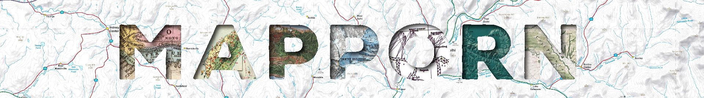

  

#                                       /r/MapPorn RedditBot

The MapPorn Redditbot is a suite of scripts that help automate and simplify moderation at [/r/MapPorn](https://www.reddit.com/r/MapPorn/). 

## Map Contest Tools 

Every month we have a monthly map contest at [/r/MapPorn](https://www.reddit.com/r/MapPorn/). Users can submit a map at any time. [On the landing page for the contest](http://www.reddit.com/r/MapPorn/wiki/meta/contest) users are instructed to send a submission to a Reddit bot's inbox. 

A raspberry pi runs the script [checkforsubmissions.py](checkforsubmissions.py) every hour checking that inbox. When the bot receives a submission, it parses the message and adds a new line to a csv with the following fields:

 * Map Name
 * Map Image URL
 * Map Description
 * Map Author
 * Unique identifier for the submission

This CSV is used to create a Reddit contest post at the end of the month. The manually run script [votingpost.py](votingpost.py) reads this CSV and creates a comment for each map submission. Users can upvote or downvote each comment.

While this is going on the CSV is renamed to submissions_current. That way if the RedditBot receives a new map submission it won't be confused in the current queue of maps being voted on. 
 
 After about a week, the contest ends. Then the script [congratulations.py](Congratulations.py) is manually run. This script gets the four highest rated comments (maps) and uses that data to make a new post to congratulate the winners. The CSV of submissions from that month is archived for a yearly contest at the end of the year.

   
   
[Rules and information about the contest can be found here](https://www.reddit.com/r/MapPorn/wiki/meta/contest)
    
## Social Media Tools
Part of MapPorn's mission is to share maps across the internet. This means using platforms other than Reddit. In the python file [functions.py](functions.py) there are functions for taking posts from [/r/MapPorn](https://www.reddit.com/r/MapPorn/) and posting to [Twitter](https://twitter.com/MapPornTweet/), [Tumblr](https://mappornofficial.tumblr.com/) and [Facebook](https://www.facebook.com/OfficialMapPorn) simultaneously. These functions use official APIs to interact with and post a link to a reddit post to those accounts.

Some other social media scripts include:

* [Multi-post_top_of_week.py](multi-post_top_of_week.py): a script to share the top [/r/MapPorn](https://www.reddit.com/r/MapPorn/) post of the week to social media
* [Top_of_month.py](top_of_month.py): same idea but shares top post of the month
* [WeeklySubmit.py](WeeklySubmit.py): posts an image to social media to advertise the map contest and solicit submissions
* [papertowns_topoftheday.py](papertowns_topoftheday.py): shares the top post of the day from [/r/Papertowns](https://www.reddit.com/r/papertowns/) to social media
* [oldmaps_topoftheday.py](oldmaps_topoftheday.py): same idea but for [/r/OldMaps](https://www.reddit.com/r/oldmaps/)
    
## Notes
See [requirements.txt](requirements.txt) for full list of requirements. These scripts utilize [PRAW](http://praw.readthedocs.io/en/latest/), [Tweepy](http://www.tweepy.org/), [PyTumblr](https://github.com/tumblr/pytumblr) and [Facebook-sdk](http://facebook-sdk.readthedocs.io/en/latest/api.html). These packages require authorization tokens that are not provided in this repository.

_Created by [/u/Petrarch1603](https://www.reddit.com/user/Petrarch1603/)   
2017 October_
