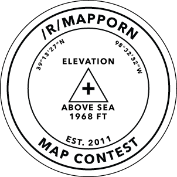

#                                       /r/MapPorn Monthly Map Contest RedditBot

Every month we have a monthly map contest at /r/MapPorn. Users can submit a map at any time. The users send a submission to a Reddit bot's inbox. A raspberry pi runs a script every hour checking that inbox. When the bot receives a submission, it parses the message and saves a csv with the following fields:

 * Map Name
 * Map Image URL
 * Map Description
 * Map Author
 * Unique identifier for the submission

This CSV is used to create a Reddit contest post at the end of the month. The script 'votingpost.py' parses this CSV and creates a comment for each map submission. Users can upvote or downvote each comment. After about a week, the contest ends. Then the script 'Congratulations.py' is run. This script gets the four highest rated comments (maps) and uses that data to make a new post to congratulate the winners. The old CSV is archived for a yearly contest at the end of the year.

   
   
####[Rules and information about the contest can be found here](https://www.reddit.com/r/MapPorn/wiki/meta/contest)

_Created by /u/Petrarch1603   
2017 November_
